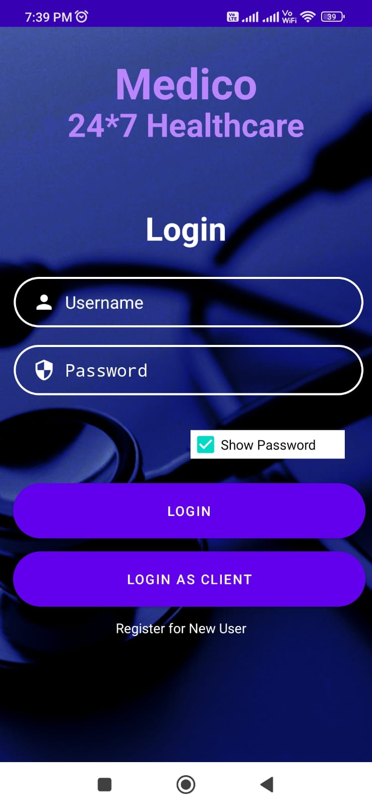
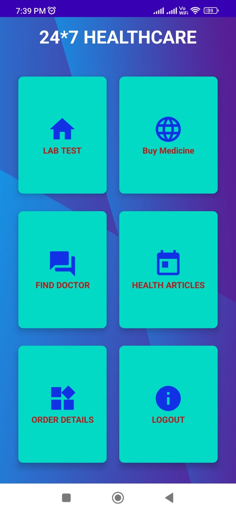
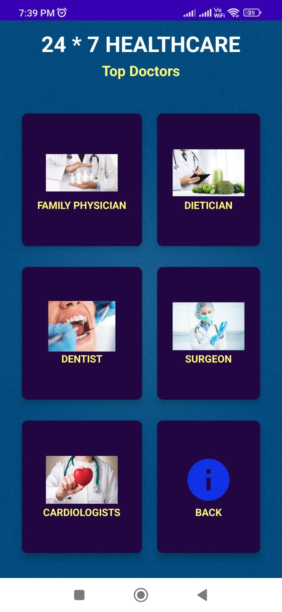
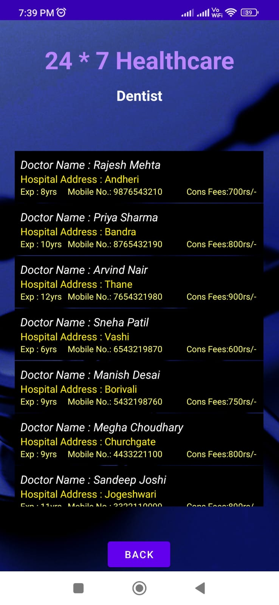
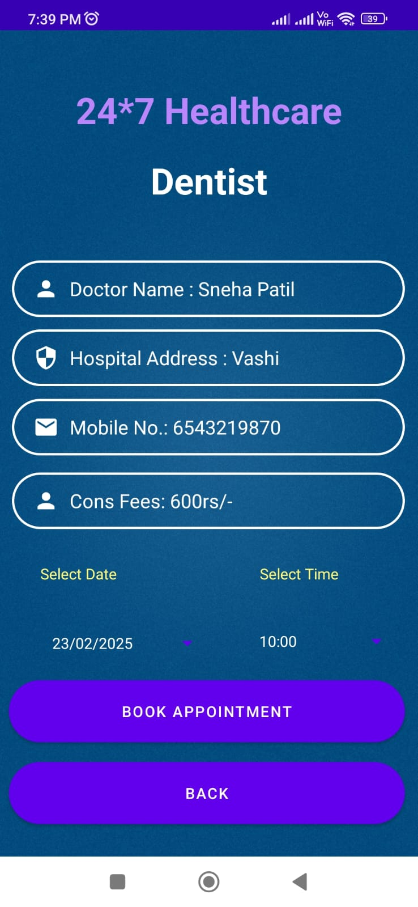
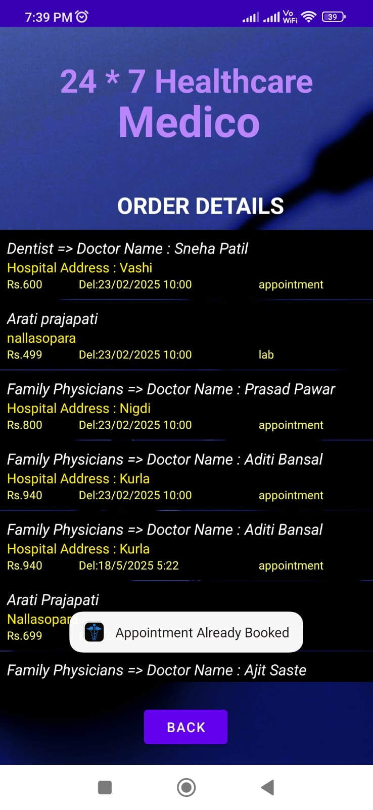
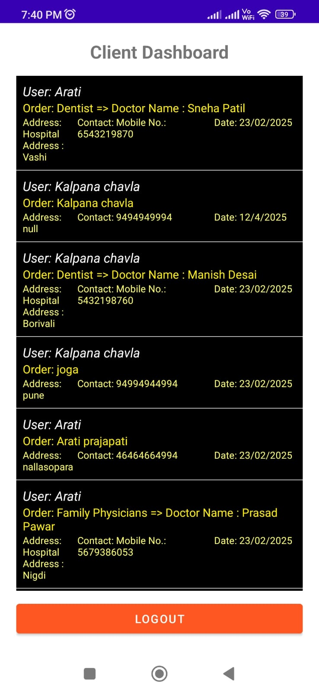

# Medico healthcare application
So, This is a Medico healthcare application. The main goal of this project is to help patients to find doctors according to their near location, buy medicines, book orders by filling their login details, and can read health related articles in an integrated platform made in a pure java language. 

# About the project:
1. Medico is the responsive app that helps patients to register and login with their login details.
2. It help patients to buy medicines, book orders, lab test details or can see orders details, or can read health related articles that helps patient to live longer and stronger.
3. All the order details of the patients will be access to the client of the Medico.
4. All the data of patients and clients will be saved on SQLite database and can be access and managed by Admin of the Medico.

# Modules in Medico 
Registration/Patient\
Client\
Admin\
Appointment\
Find Doctors\
Buy medicines\
Lab test\
Health articles\
Order details\
Appointment\
User Module\
Doctors\
and more...

Use below credentials for Client login to see patient records

   Username  : Client\
   Password  : Client@123

# Screenshots 
     
  

# Need help?
If you have any issues please send us mail at prajapatiarati349@gmail.com more than happy to help you in understanding and installing.
